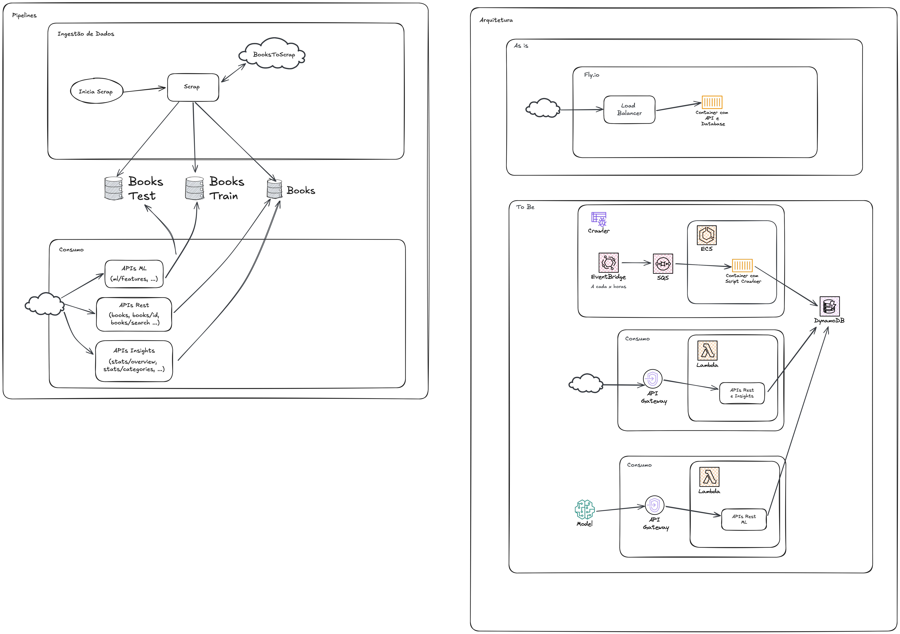

# FIAP ML - Sistema de Gerenciamento de Livros

Sistema completo de gerenciamento de livros com funcionalidades de web scraping, API REST e análise de dados. O projeto permite coletar dados de livros de sites externos, armazená-los em CSV e fornecer uma API para consulta e análise.

## 📋 Índice

- [Visão Geral](#visão-geral)
- [Arquitetura do Sistema](#arquitetura-do-sistema)
- [Classes e Componentes](#classes-e-componentes)
- [Configuração](#configuração)
- [Instalação](#instalação)
- [Uso](#uso)
- [API Endpoints](#api-endpoints)
- [Estrutura do Projeto](#estrutura-do-projeto)

## 🎯 Visão Geral

Este projeto é um sistema completo de gerenciamento de livros que inclui:

- **Web Scraping**: Coleta automática de dados de livros do site books.toscrape.com
- **API REST**: Interface para consulta e análise dos dados coletados
- **Análise de Dados**: Estatísticas e insights sobre os livros
- **Autenticação JWT**: Sistema de segurança para a API
- **Armazenamento**: Dados persistidos em arquivo CSV

## 🏗️ Arquitetura do Sistema

O sistema é dividido em três camadas principais:

1. **Camada de Coleta (Scraping)**: Responsável por extrair dados de sites externos
2. **Camada de Dados**: Gerencia o acesso e análise dos dados armazenados
3. **Camada de API**: Fornece endpoints REST para consulta dos dados



## 📚 Classes e Componentes

### 🕷️ Módulo de Scraping (`src/data_scrape/Scrap/`)

#### `Scrap` (Classe Base)
```python
class Scrap:
    def get_page_content(self, url: str) -> str
```
- **Propósito**: Classe base para operações de web scraping
- **Funcionalidades**: 
  - Faz requisições HTTP para URLs
  - Verifica status de resposta
  - Retorna conteúdo da página

#### `ScrapMainPage`
```python
class ScrapMainPage(Scrap):
    def get_all_books_url(self) -> list[str]
    def get_all_books(self, page: int) -> list[str]
```
- **Propósito**: Extrai URLs de todos os livros do site principal
- **Funcionalidades**:
  - Navega por todas as páginas do catálogo
  - Extrai links individuais de cada livro
  - Retorna lista completa de URLs

#### `ScrapBook`
```python
class ScrapBook(Scrap):
    def get_all_books_info(self, all_books_url: list[str])
    def get_book_info(self, book_url: str) -> Optional[Book]
    def mount_book_info(self, book_url: str, book_info_page: BeautifulSoup) -> Book
    def save_all_books_info_to_csv(self, all_books_info: list[Book])
    def get_number_from_string(self, string: str) -> int
```
- **Propósito**: Extrai informações detalhadas de cada livro
- **Funcionalidades**:
  - Processa cada URL de livro individualmente
  - Extrai título, categoria, preço, rating, imagem
  - Salva dados em arquivo CSV
  - Converte ratings textuais para números

### 📊 Módulo de Dados (`src/data/`)

#### `CsvDataSource`
```python
class CsvDataSource:
    def get_all_books(self, page: int = 1) -> List[Book]
    def get_book(self, book_id: str) -> Book|None
    def search(self, page: int = 1, **kwargs) -> List[Book]
    def get_all_categories(self) -> List[str]
    def health(self) -> bool
    def set_rating_for_category_price(self, category: str, price: float, rating: int) -> int
```
- **Propósito**: Gerencia acesso aos dados do CSV usando DuckDB
- **Funcionalidades**:
  - Paginação de resultados
  - Busca por ID específico
  - Busca por título e categoria
  - Listagem de categorias
  - Verificação de saúde do sistema

#### `CsvAnalysisDataSource`
```python
class CsvAnalysisDataSource:
    def books_count(self) -> int
    def prices_average(self) -> Decimal
    def rating_distribution(self) -> Dict[int, int]
    def categories_books_count(self) -> Dict[str, int]
    def categories_prices_data(self) -> Dict[str, Dict[str, float]]
    def books_best_rated(self, qty: int = 0) -> List[str]
    def books_filtered_by_price(self, min: float = 0, max: float = sys.float_info.max, qty: int = 0) -> List[str]
```
- **Propósito**: Fornece análises estatísticas dos dados
- **Funcionalidades**:
  - Contagem total de livros
  - Preço médio dos livros
  - Distribuição de ratings
  - Estatísticas por categoria
  - Livros melhor avaliados
  - Filtros por faixa de preço

#### `UserDataSource`
```python
class UserDataSource:
    def checkpass(self, user: str, password: str) -> bool
```
- **Propósito**: Gerencia autenticação de usuários
- **Funcionalidades**:
  - Validação de credenciais
  - Leitura de usuários do CSV

### 🏗️ Módulo de Modelos (`src/model/`)

#### `Book`
```python
@dataclass
class Book:
    id: str
    author: str
    year: int
    title: str
    category: str
    stock: int
    price: Decimal
    rating: int
    image: str
```
- **Propósito**: Representa um livro no sistema
- **Atributos**:
  - `id`: Identificador único
  - `author`: Autor do livro
  - `year`: Ano de publicação
  - `title`: Título do livro
  - `category`: Categoria/genre
  - `stock`: Quantidade em estoque
  - `price`: Preço (Decimal para precisão)
  - `rating`: Avaliação (1-5)
  - `image`: URL da imagem

#### `BookModel` (SQLAlchemy)
```python
class BookModel(Base):
    __tablename__ = "books"
    # Mapeamento para DuckDB
```
- **Propósito**: Modelo ORM para acesso ao banco DuckDB
- **Funcionalidades**: Mapeamento automático entre CSV e objetos Python

### 🔐 Módulo de API (`src/webapi/api/`)

#### `app.py` (FastAPI Application)
```python
# Endpoints principais:
@app.get("/books")                    # Lista todos os livros
@app.get("/books/top-rated")          # Livros melhor avaliados
@app.get("/books/price-range")        # Filtro por faixa de preço
@app.get("/books/search")             # Busca por título/categoria
@app.get("/books/{book_id}")          # Livro específico por ID
@app.get("/categories/")              # Lista categorias
@app.get("/health/")                  # Status do sistema
@app.get("/stats/overview")           # Estatísticas gerais
@app.get("/stats/categories")         # Estatísticas por categoria

# Endpoints de ML:
@app.get("/ml/features")              # Dataset de features (books_test)
@app.get("/ml/training-data")         # Dataset de treino (books_train)
@app.get("/ml/predictions")           # Predição de rating por categoria e preço

# Endpoints auth Info
@app.post("/auth")                    # Autenticação JWT
```

#### `security.py`
```python
def check_password(user: str, password: str) -> bool
def emit_jwt(user: str, password: str) -> str
def check_jwt(token: str) -> bool
```
- **Propósito**: Gerencia autenticação e autorização
- **Funcionalidades**:
  - Validação de senhas
  - Geração de tokens JWT
  - Verificação de tokens
  - Expiração automática (30 minutos)

#### `models.py`
```python
@dataclass
class ListReturn:      # Resposta paginada
class Userlogin:       # Dados de login
@dataclass
class HealthReturn:    # Status do sistema
@dataclass
class PredictionReturn:  # Resposta de predição de rating
    status: str
    category: str
    price: float
    rating: int
```

#### `filters.py`
```python
class BookFilterParameters:        # Filtros de busca
class PageFilterParameters:        # Paginação
class ItemQtyFilterParameters:     # Limite de itens
class BookPriceRangeParameters:    # Faixa de preço
class PredictRatingParameters:     # Parâmetros para predição de rating (categoria, preço)
```

## ⚙️ Configuração

### Variáveis de Ambiente
Criar arquivo `.env` na raiz do projeto:

```env
DATABASE_PATH=mockdata/books.csv
PAGE_SIZE=10
```

### Pré-requisitos
- Python >= 3.12
- Poetry (gerenciador de dependências)
- Poe (task runner para pyproject - https://poethepoet.natn.io/index.html)

## 🚀 Instalação de ambiente para desenvolvimento local

### Instalação inicial
```bash
poetry install --with dev
```

## 💻 Uso

### Iniciar em Desenvolvimento
```bash
poe servedev
```

### Executar Scraping
```bash
poe scrap
```

### Executar Aplicação
```bash
poe run
```

## 🔌 API Endpoints

### Autenticação
 
Para obter o token de autenticação, registre o usuário e senha no arquivo `mockdata/users.csv` e faça um request no endpoint abaixo. 

```bash
POST /api/v1/auth
Content-Type: application/json

{
  "username": "usuario",
  "password": "senha"
}
```

Com o retorno dessa request, use o token (como cabeçalho `Authorization: Bearer`) para efetuar as chamadas subsequentes

### Endpoints Protegidos
Todos os endpoints (exceto `/auth`) requerem token JWT no header:
```bash
Authorization: Bearer <seu_token_jwt>
```

### Principais Endpoints

| Método | Endpoint | Descrição |
|--------|----------|-----------|
| GET | `/books` | Lista todos os livros (paginado) |
| GET | `/books/top-rated` | Livros melhor avaliados |
| GET | `/books/price-range` | Filtro por faixa de preço |
| GET | `/books/search` | Busca por título/categoria |
| GET | `/books/{id}` | Livro específico |
| GET | `/categories/` | Lista categorias |
| GET | `/stats/overview` | Estatísticas gerais |
| GET | `/stats/categories` | Estatísticas por categoria |
| GET | `/health/` | Status do sistema |

### Endpoints de ML

| Método | Endpoint | Descrição |
|--------|----------|-----------|
| GET | `/ml/features` | Retorna o dataset de features (mock `books_test.csv`) |
| GET | `/ml/training-data` | Retorna o dataset de treino (mock `books_train.csv`) |
| GET | `/ml/predictions` | Prediz o rating para uma categoria e preço |

Detalhes do endpoint de predição:

```bash
GET /api/v1/ml/predictions?category=<categoria>&price=<preco>
Authorization: Bearer <seu_token_jwt>
```

Resposta:

```json
{
  "status": "ok",
  "category": "Fantasy",
  "price": 12.5,
  "rating": 7
}
```

Observações:
- O rating atualmente é gerado aleatoriamente (1..10) enquanto o modelo de ML não é integrado (TODO).
- A requisição é registrada em `mockdata/ml_request.csv` pela função `set_rating_for_category_price`.

## 📁 Estrutura do Projeto

```
fiap-ml/
├── src/
│   ├── Scrap/                 # Módulo de web scraping
│   │   ├── Scrap.py          # Classe base
│   │   ├── ScrapMainPage.py  # Extração de URLs
│   │   └── ScrapBook.py      # Extração de dados
│   ├── data/                 # Camada de dados
│   │   ├── csvds.py          # Acesso ao CSV
│   │   ├── csvdatads.py      # Análise de dados
│   │   ├── userds.py         # Usuários
│   │   └── model/
│   │       └── bookmodel.py  # Modelo ORM
│   ├── api/                  # Camada de API
│   │   ├── app.py           # Aplicação FastAPI
│   │   ├── models.py        # Modelos de resposta
│   │   ├── security.py      # Autenticação
│   │   └── filters.py       # Filtros de query
│   ├── model/               # Modelos de domínio
│   │   └── book.py          # Entidade Book
│   ├── main.py              # Ponto de entrada
│   └── scrap_book_toscrape.py # Script de scraping
├── mockdata/                # Dados de exemplo
├── docs/                    # Documentação
├── tests/                   # Testes
└── pyproject.toml          # Configuração Poetry
```

## 👥 Autores

- **Erick Muller** - erick@em.pro.br
- **José Rubens Rodrigues** - joserrodrigues@yahoo.com.br

## 🛠️ Tecnologias Utilizadas

### Ferramentas
- **Python >= 3.12**: Linguagem principal, para processos de dados e criação da API
- **Poetry**: Gerenciamento de dependências

## Bibliotecas
- **FastAPI**: Framework web para API REST
- **DuckDB**: Banco de dados analítico
- **BeautifulSoup4**: Web scraping
- **Pandas**: Análise de dados
- **PyJWT**: Autenticação JWT
- **SQLAlchemy**: ORM


## 📝 Licença

Este projeto é parte do curso FIAP de Machine Learning.


## TO DO
- [x] Repositório do GitHub Organizado
- [x] Sistema de Web Scraping
- [x] API RESTful Funcional
	- [x] Endpoints Core
	- [x] Endpoints de Insights
	- [x] Doc Swagger
- [x] Realizar o deploy da aplicação em Fly.io
- [x] Plano Arquitetural
- [] Vídeo de Apresentação (3-12 minutos)
- [x] Opcional - Desafio 1: Sistema de Autenticação OK 
- [x] Opcional - Pipeline ML-Ready
- [] Opcional - Monitoramento & Analytics
